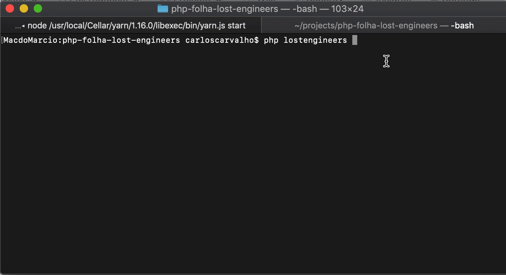

## Desafio Folha Uol 

Levados do planeta Terra por uma nave alienígena, um grupo de 75 engenheiros espera saber qual será o seu destino solucionando um enigma proposto pelos seus novos amigos. As informações que receberam dizem que a espaçonave seguirá pelo espaço até atingir um de cinco sistemas estelares próximos: SIRIUS, LALANDE, PROCION, ALPHA CENTAURI ou BARNARD.


O local de chegada pode ser conhecido sabendo que as vogais do nome da estrela são atribuídas à uma sequência Fibonacci que começa em 1 e termina em 8, onde A = 1, E = 2, I = 3, O = 5 e U = 8. Se a multiplicação das vogais der o mesmo número que a quantidade de engenheiros, a estrela de destino será conhecida.


Qual estrela será o destino da espaçonave?


## Nosso resultado foi




### Quer rodar o projeto localmente ?

**Requisitos**
```
> php >= 7
```

**Rodando o projeto**

```bash
$ git clone https://github.com/carlosocarvalho/php-folha-lost-engineers.git

$ cd php-folha-lost-engineers && composer install
```

```bash
# rodando esse commando e pronto
php lostengineers
```